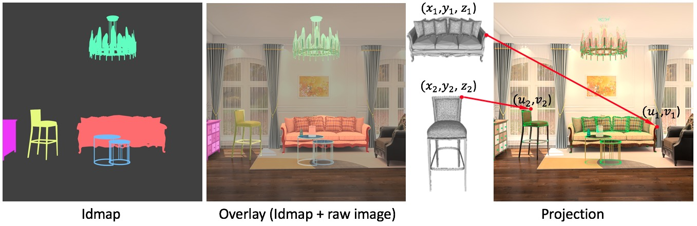
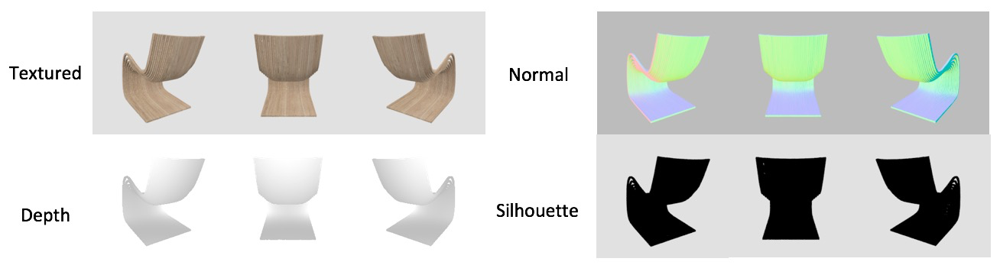
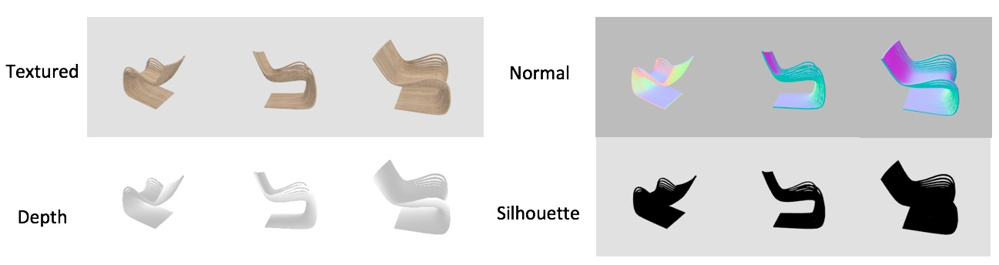
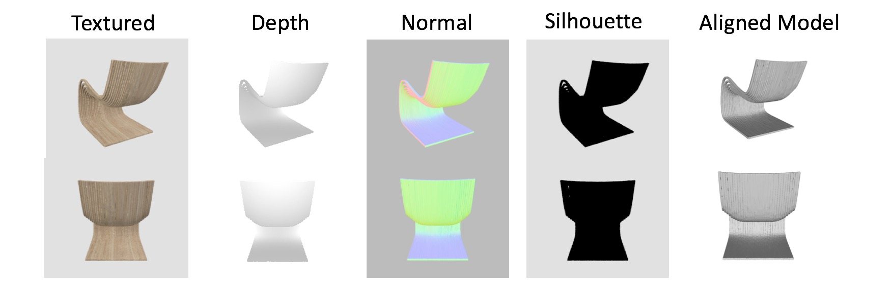
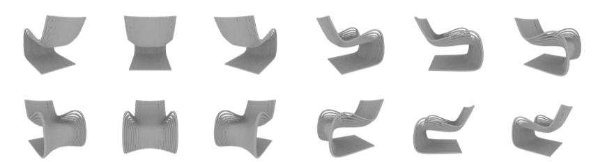
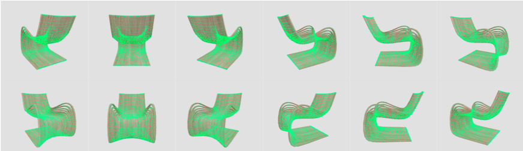
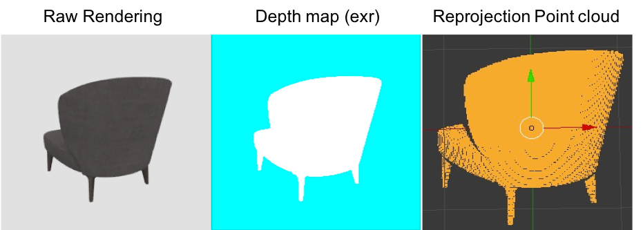

# Python toolbox for the FUTURE3D TianChi AI Challenge
This python based toolbox provides demos on how to render images, and project/reprojecte 3D/2D points using FUTURE3D data.

## Requirements

* Blender 2.7.9b (<https://www.blender.org/download/releases/2-79/>)
* Open3d
* Scipy = 1.4.1
* Numpy
* OpenCV

#### Blender Python
Default blender python environment is different with your custom python environment, so you may need to install required python modules(e.g. Numpy) for blender python following totorials below:

* <http://www.codeplastic.com/2019/03/12/how-to-install-python-modules-in-blender/>

* <https://blender.stackexchange.com/questions/5287/using-3rd-party-python-modules>

If above tutorials do not work for you, you can add custom environment path into system path in python script as below : (more details please refert to ```demo_render_object_mv_with_corrs_model.py```)
```
# add custom python env
sys.path += ['/home/shunming/software/envs/dnn/lib/python3.6/site-packages'] # Please change into your path
```
## How to use
### 1. Scene images
#### Idmap rendering
With provided models and pose, you can generate idmap using blender (Instance Segmentation only).

```python
bash scripts/demo_render_scene_image.sh
```

#### 3D - 2D Projection

```
bash scripts/demo_project_scene.sh
```




### 2. Multi-view images
Please normalize models into (-1, 1) with ```norm_model.py```, if using default settings. 
#### Texture rendering
This script support rendering for textured image, normal image, depth image and silhouette image. The type of depth image is RGBA, so you need to convert it into RGB to get correct relative depth values (range from 0 to 255).

Note: If you want to get true depth value, please use 'OPEN_EXR' instead of 'PNG' in blender.
```
bash demo_render_object_mv_with_texture.sh
```
<div align=center></div>

#### Random view rendering
If provided multi-view images are not enough for your training(default: 12 views), you can run this script to generate more data with random viewpoints. Same as texture rendering, this script also supports depth image, normal image, and silhouette image
```
bash demo_render_object_with_texture_random.sh
```
<div align=center></div>

#### Model aligned rendering

Generate four different types of rendering image as well as relevant obj model with aligned pose. This would help to create your own dataset, especially for the reconstruction task.

<div align=center></div>

#### No-texture rendering

```
bash scripts/demo_render_object_mv_without_texture.sh
```
<div align=center></div>


#### 3D - 2D Porjection
With 3D models, 2D rendering images, and relevant pose info, you can project 3D points into 2D image plane using this script - valid for both simple multi-view images(12 views) and random view images.
```
bash scripts/demo_project_mv.sh
```
<div align=center></div>

#### 2D - 3D Re-projection (depth map)

Giving a depth map(type-exr, true value), reproject 2d points into camera coordinate.

```
bash scripts/demo_reprojection_mv.sh
```

<div align=center></div>

#### Rendering with pose

```
bash scripts/demo_render_object_with_texture_pose.sh
```

